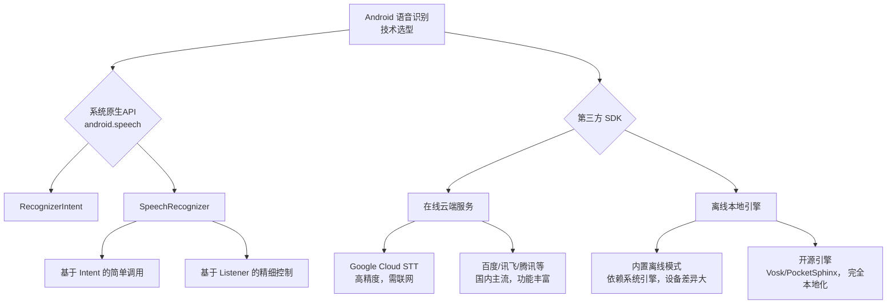

Android 系统确实提供了原生的语音识别（STT）服务。对于你的项目来说，将它作为备选方案来降低延迟和解决网络依赖问题，是值得尝试的。

下图清晰地展示了 Android STT 服务的完整技术生态与选型路径：


## 💡 为什么 Android 原生 STT 值得考虑
*   **📦 零集成成本**：Android 原生 STT API 属于 `android.speech` 包，是 Android 框架的一部分，无需集成任何第三方 SDK 即可使用。
*   **✈️ 支持离线识别**：从 Android 4.1 (API Level 16) 开始就支持离线识别了。通过设置 `EXTRA_PREFER_OFFLINE` 参数，你可以优先使用设备本地的语音引擎。
*   **📉 降低延迟**：离线模式省去了网络往返的耗时，延迟能从在线方案的 `500-1000ms` 降低到 `200-500ms` 甚至更少，对导航这种实时交互场景体验改善很大。
*   **🔒 保护隐私**：所有音频数据都在设备本地处理，不会上传到云端，这对注重隐私的场景来说是个加分项。

## 📝 如何实现
使用 Android 原生 STT 主要有两种方式，下面分别给出实现代码。

### 方式一：使用 `RecognizerIntent`
这种方式最简单，它调用系统默认的语音识别界面，代码量很少。

```kotlin
// 1. 检查设备是否支持
if (!SpeechRecognizer.isRecognitionAvailable(this)) return

// 2. 配置并启动识别
val intent = Intent(RecognizerIntent.ACTION_RECOGNIZE_SPEECH).apply {
    putExtra(RecognizerIntent.EXTRA_LANGUAGE_MODEL, RecognizerIntent.LANGUAGE_MODEL_FREE_FORM)
    putExtra(RecognizerIntent.EXTRA_LANGUAGE, Locale.getDefault())
    putExtra(RecognizerIntent.EXTRA_PROMPT, "请说出目的地...")
    // 🔑 关键：强制使用离线模式
    putExtra(RecognizerIntent.EXTRA_PREFER_OFFLINE, true)
}
startActivityForResult(intent, REQUEST_CODE_SPEECH_INPUT)

// 3. 处理识别结果
override fun onActivityResult(requestCode: Int, resultCode: Int, data: Intent?) {
    if (requestCode == REQUEST_CODE_SPEECH_INPUT && resultCode == RESULT_OK) {
        data?.getStringArrayListExtra(RecognizerIntent.EXTRA_RESULTS)
            ?.let { results ->
                val spokenText = results[0] // 获取识别文本
                // 将 spokenText 用于后续处理，如设置导航目的地
            }
    }
}
```

### 方式二：使用 `SpeechRecognizer`
如果需要更精细的控制，比如实时识别或自定义界面，可以使用 `SpeechRecognizer` 配合 `RecognitionListener`。

```kotlin
class SpeechRecognizerManager(private val context: Context) {
    private val speechRecognizer = SpeechRecognizer.createSpeechRecognizer(context)

    fun startListening(onResult: (String) -> Unit) {
        speechRecognizer.setRecognitionListener(object : RecognitionListener {
            override fun onResults(results: Bundle?) {
                results?.getStringArrayList(SpeechRecognizer.RESULTS_RECOGNITION)
                    ?.firstOrNull()?.let { recognizedText ->
                        onResult(recognizedText)
                    }
            }
            override fun onError(error: Int) { /* 处理错误 */ }
            // 其他回调...
        })

        val intent = Intent(RecognizerIntent.ACTION_RECOGNIZE_SPEECH).apply {
            putExtra(RecognizerIntent.EXTRA_LANGUAGE_MODEL, RecognizerIntent.LANGUAGE_MODEL_FREE_FORM)
            putExtra(RecognizerIntent.EXTRA_PREFER_OFFLINE, true) // 请求离线识别
        }
        speechRecognizer.startListening(intent)
    }

    fun destroy() { speechRecognizer.destroy() }
}
```

## 🚀 进一步提升离线体验
原生 API 的离线识别效果受限于设备厂商的实现。如果遇到识别效果不理想的问题，可以考虑以下几个**完全本地化、延迟更低且可控性更高的方案**：

*   **Vosk**：开源，支持20+种语言和中文，模型大小可裁剪至15MB，延迟低且提供离线流式识别。
*   **PocketSphinx**：轻量级开源方案，支持自定义词典和指令集，特别适合做离线指令识别。
*   **Google ML Kit**：Google 提供的移动端机器学习套件，支持离线语音识别，但需要Google Play服务支持。

## ⚠️ 重要前提条件
在使用 Android 原生 STT 前，务必确认以下几点：

1.  **权限声明**：在 `AndroidManifest.xml` 中添加录音权限。
    ```xml
    <uses-permission android:name="android.permission.RECORD_AUDIO" />
    ```
2.  **设备支持**：通过 `SpeechRecognizer.isRecognitionAvailable(context)` 检查设备是否支持语音识别。
3.  **离线包依赖**：离线模式需要用户在手机 `设置 → 语言与输入法 → 语音输入` 中下载好离线语言识别包。
4.  **服务可用性**：国内部分定制系统可能阉割Google服务，需要提前做好机型兼容性适配。

Android 原生 STT 最大的诱惑在于可以免费离线使用，能从根本上解决网络依赖和延迟问题。最经济的做法是先在你的项目中增加对原生 STT 的试错，看看能否满足基本的导航指令识别需求。如果需求变得更复杂，再考虑集成轻量级离线引擎。